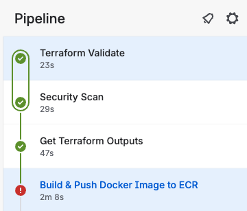

+++
date = '2026-06-24T12:38:53+02:00'
draft = false
title = 'Reducing Trivy Noise and Making CI/CD Scans Actually Useful'
tags = ['trivy', 'cve', 'security', 'docker', 'java']
+++


Some weeks ago I added [trivy](trivy) scanning in my pipeline. It's just good CI/CD to have a CVE scanner and here's how I cleared the noice and optimized it

```
trivy image \  
  --severity HIGH,CRITICAL \  --exit-code 1 \  $IMAGE_WITH_TAG
```

So my pipeline failed with a few HIGH vulnerability



## So now the problem for developers are :

NOISE or PRIORITY FIX ?
Flexibility is always nice
**one way is to return exit-code 0 so it doesn't fail the pipeline**

# But then whats the point ??

So I found a post in medium [https://medium.com/@DynamoDevOps/trivy-is-noise-by-default-heres-the-seven-rule-filter-that-catches-real-risk-05c4c3249c26](https://medium.com/@DynamoDevOps/trivy-is-noise-by-default-heres-the-seven-rule-filter-that-catches-real-risk-05c4c3249c26)

that had 7 rules for python. Let's apply it on java then:

## Rule One: Skip Vulnerabilities With No Fix Available

Nice to skip ones without fixes yet

```bash
trivy image --ignore-unfixed myapp:latest
```

## Rule Two: Focus on High and Critical Only

Let's get real and focus on developing value for the business & production

```bash
trivy image --severity HIGH,CRITICAL myapp:latest
```

## Rule Three: Use Multi-Stage Builds to Ship Clean Images

Clean code and optimize the docker builds.
I minimize the size of my docker image from 690MB ->199 MB

![[Pasted image 20251110172342.png]
I assigned a small builder for my multistage builder

```bash
FROM maven:3.9-eclipse-temurin-21-alpine AS mvn-build  
```

**Pasted image 20251114172650.png**

## Rule Four: Stop repeating CVEs

Maintain a `.trivyignore` File for Reviewed Issues
I understand this. After awhile, developer will ignore the report if there're some unnecessary CVEs reported

## Rule Five: Limit the Scan Scope to Only What Matters

We use .dockerignore to exclude files we don't want to package, so use trivyignore to skip files or CVEs we acknowlege a vulnerability that we want to supress

```bash
CVE-2022-1234
CVE-2021-5678
```

we could skip files these way too

```bash
trivy fs --skip-dirs .git,node_modules /project
trivy fs --skip-files LICENSE.md README.md
```

Or I'd exclude the files from docker images with .ignoredocker

support multi arch so you don't maintain multiple dockerfiles

```bash
# Multi-arch Dockerfile using BuildKit  
ARG TARGETPLATFORM
```

## Rule Six: Scan SBOMs Instead of Full Images When Possible

on this one I'd skip it
not many companies I work with actually generate SBOMs
However, if you do...
**Syft** is a command line tool to generate it
Nice audit on the tools we use

```bash
trivy sbom sbom.spdx.json
```

## Rule Seven: Parse Output Automatically in JSON Format

we could send the json to our security teams
So just the summaries reach the people who wants the info

```yaml
# Multi-arch Dockerfile using BuildKit  
ARG TARGETPLATFORM  
FROM maven:3.9-eclipse-temurin-21-alpine AS mvn-build  
  
ARG SKIP_TESTS=true  
ENV HOME=/usr/src/app  
WORKDIR $HOME  
  
COPY pom.xml .  
  
# Download dependencies (cached layer)  
RUN --mount=type=cache,target=/root/.m2 mvn dependency:go-offline -B  
COPY src ./src  
  
# Use BuildKit cache for Maven dependencies  
RUN --mount=type=cache,target=/root/.m2 mvn -f $HOME/pom.xml clean package \  
                -DskipTests=${SKIP_TESTS} \  
                -DskipITs=${SKIP_TESTS}  
  
# Runtime stage - multi-arch compatible  
FROM eclipse-temurin:21-jre-alpine  
  
#Build args for configurable memory settings  
ARG XMX=512  
ENV XMX=$XMX  
ENV VAR_XMX=-Xmx${XMX}m  
ENV APP_HOME=/app  
WORKDIR $APP_HOME  
  
# Copy artifacts using wildcard to avoid hardcoded names  
COPY --from=mvn-build /usr/src/app/target/*.jar ./cv-generator.jar  
COPY --from=mvn-build /usr/src/app/src/main/resources/documentdb-truststore.jks ./documentdb-truststore.jks  
  
# Create non-root user and set permissions (Alpine Linux commands)  
RUN addgroup -g 1000 -S cv-generator && \  
    adduser -u 1000 -S cv-generator -G cv-generator && \  
    chown -R cv-generator:cv-generator $APP_HOME && \  
    chmod 644 $APP_HOME/documentdb-truststore.jks  
  
USER cv-generator  
  
EXPOSE 8080 5005  
  
# Enable remote debugging  
ENV JAVA_TOOL_OPTIONS="-agentlib:jdwp=transport=dt_socket,server=y,suspend=n,address=*:5005"  
  
# Set default Spring profile for AWS deployment, but allow override via SPRING_PROFILES_ACTIVE env var  
ENV SPRING_PROFILES_ACTIVE=aws  
  
# Use sh -c to allow VAR_XMX and SPRING_PROFILES_ACTIVE expansion at runtime  
ENTRYPOINT ["sh", "-c", "exec java \  
                -Xmx${XMX}m \  
                -Xss512k \                
                -XX:+UseContainerSupport \                
                -XX:MaxRAMPercentage=75.0 \                
                -Djavax.net.ssl.trustStore=/app/documentdb-truststore.jks \                
                -Djavax.net.ssl.trustStorePassword=changeit \                
                -Dspring.profiles.active=${SPRING_PROFILES_ACTIVE} \  
                -jar /app/cv-generator.jar"]
```
